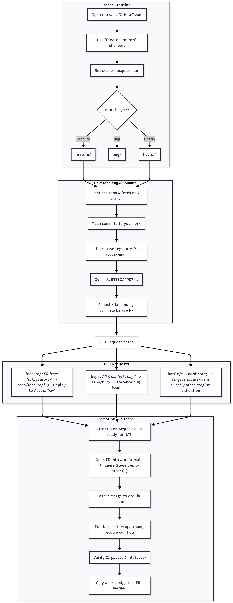

# [Bebbo](https://bebbo.app/) CMS - Drupal content management system

## Table of Contents
* [Introduction](#introduction)
* [Installation](#installation)
  * [Pre-requisites](#pre-requisites)
  * [Configuration](#configuration)
  * [Run the Application](#run-the-application)
  * [Local Configuration Management](#local-configuration-management)
* [CI/CD Security Practices](#cicd-security-practices)
* [Branching Strategy](#branching-strategy)
* [Maintainers](#maintainers)
* [Community](#community)

## Introduction
Parent Buddy CMS application is a headless implementation of Drupal 10 CMS where the content is added through the web interface and serves as REST APIs for a mobile app. This application assists editors in adding different types of content under various content types and taxonomies configured in Drupal CMS. Go through the [onboarding document](./docs/ONBOARDING.md) before continuing with the Installation guidelines below.

For more information on setup and getting started, check out our [guidelines for contributors](./docs/CONTRIBUTING.md).

## Installation

### Pre-requisites
Before installing the Bebbo CMS application, ensure that you have the following software installed on your development machine:

- **DDEV with PHP 8.3 runtime**: The recommended local environment is [DDEV](https://docs.ddev.com/en/stable/) running PHP 8.3. Install DDEV following the official instructions for your platform, making sure PHP 8.3 is selected in `.ddev/config.yaml` (or via `ddev config global --php-version 8.3`).
  - **Windows**: Requires Windows 10/11 Pro, [WSL2](https://learn.microsoft.com/windows/wsl/install), [Docker Desktop](https://www.docker.com/products/docker-desktop/), [mkcert](https://github.com/FiloSottile/mkcert) and the [DDEV Windows prerequisites](https://docs.ddev.com/en/stable/users/install/ddev-installation/#windows). Install mkcert via Chocolatey (`choco install mkcert`) and trust certificates with `mkcert -install`.
  - **macOS**: Install [Homebrew](https://brew.sh/), [Docker Desktop](https://www.docker.com/products/docker-desktop/) (or [Colima](https://docs.ddev.com/en/stable/users/install/docker-installation/#colima) on Apple Silicon), and mkcert (`brew install mkcert nss && mkcert -install`). Follow the [macOS DDEV guide](https://docs.ddev.com/en/stable/users/install/ddev-installation/#macos).
  - **Linux (Ubuntu/Debian)**: Install Docker Engine, Docker Compose, mkcert, and inotify tools per the [Linux setup guide](https://docs.ddev.com/en/stable/users/install/ddev-installation/#linux). For Ubuntu you can run `sudo apt install mkcert libnss3-tools` and then `mkcert -install`. Ensure your user is added to the `docker` group.
- **Composer**: [Composer Installation Guide](https://getcomposer.org/doc/00-intro.md#installation-linux-unix-osx). If you skip the global install, run Composer via `php composer.phar`.
- **Drush** (CLI helper): `composer global require drush/drush`.
- **Git**: Required to clone this repository.

### Configuration
After installing all the pre-requisites, follow the steps below to set up the Bebbo CMS:
For Windows users, before proceeding to the next step, run the following command:
```
git config --global core.longpaths true
```
1. Clone the repository from GitHub:
   ```
   git clone https://github.com/UNICEFECAR/parenting-app-bebbo-CMS
   cd parenting-app-bebbo-CMS
   ```
2. Start the existing DDEV environment (the `.ddev` directory is already committed):
   ```
   ddev start
   ```
   If you need to confirm URLs or container details, run `ddev describe`.
3. Install Composer dependencies inside the container:
   ```
   ddev composer install
   ```
4. Download the database from the Acquia server and import it locally. If you don’t have access to Acquia, you can download the dump database [here](https://drive.google.com/file/d/1mha-fwtKjb7931MFCEcAXVNOQt_IJ7Ce/view).
   ```
   ddev import-db --src=/path/to/bebbo.sql.gz
   ```
5. Import public files if required:
   ```
   ddev import-files --src=/path/to/files.tar.gz
   ```
6. Review or adjust database credentials and other overrides in `docroot/sites/default/settings.php` or a `settings.local.php` include if your environment requires it (DDEV auto-injects settings via `settings.ddev.php`).
7. If DDEV fails to start, inspect the container logs with:
   ```
   ddev logs
   ```

### Run the Application
Launch the application in your browser to verify everything is set up correctly.
1. Start the container stack (`ddev start`) and open the site with `ddev launch`.
2. You can also list the site links with `ddev describe`. If running the installer from scratch, follow the standard Drupal steps (choose profile, enter DB credentials, etc.). When using the shared database dump this step is already completed—log in via `ddev drush uli`.
3. Complete any post-install configuration and confirm the Drupal homepage loads without errors. If you encounter startup issues, review logs via `ddev logs`.

### Local Configuration Management

All configuration synchronization is managed locally using Drush commands.
#### Check Pending Configuration Changes
Shows differences between the active configuration (database) and the configuration files in the sync directory.
```
ddev drush config:status
```

#### Import Configuration (YAML → Database)

Use this when you need to apply configuration from config/default into your local database:
```
ddev drush cim -y
ddev drush cr
```
#### Export Configuration (Database → YAML)

Use this when you make changes through the Drupal UI and need to update the configuration files:
```
ddev drush cex -y
ddev drush cr
```

## CI/CD Security Practices
The automated pipeline defined in [.github/workflows/pipelines.yml](.github/workflows/pipelines.yml) enforces several security measures that contributors should be aware of:

- **Credentials isolation**: Acquia API keys, SSH keys, and host fingerprints are consumed exclusively via encrypted GitHub Secrets (`ACQUIA_API_KEY_ID`, `ACQUIA_API_KEY_SECRET`, `ACQUIA_SSH_PRIVATE_KEY`, `ACQUIA_SSH_KNOWN_HOSTS`). Secrets are injected only into the relevant deploy jobs.
- **Hardening SSH connectivity**: The workflow provisions SSH access using `webfactory/ssh-agent` with the private key from secrets and explicitly pins the Acquia Git host fingerprint via `ssh-keyscan` before any remote interaction.
- **Clean build environments**: Every job starts from a fresh `ubuntu-latest` runner, pins PHP 8.3 via `shivammathur/setup-php`, and performs `git reset --hard` / `git clean -fd` prior to artifact pushes to avoid leaking untracked files.
- **Dependency and code integrity checks**: `composer validate`, `composer install --no-interaction`, PHPCS, `drupal-check`, and `phplint` run on each push/PR to catch tampered dependencies or insecure code patterns before deployment.
- **Scoped deployments**: Deploy jobs only run for specific branch patterns (feature/* to Dev, `main` to Stage) after CI checks pass (`needs: ci-checks`) ensuring only vetted code can reach Acquia environments.
- **Auditable automation account**: Git author identity for automated commits to Acquia Git is consistently set to `github-actions+bebbo@unicef.org`, making bot activity traceable in repository history.

## Branching Strategy
Follow these guidelines to keep work streams predictable and in sync with the Acquia environments:

1. **Create branches from issues**
   - Open the relevant GitHub issue and use the “Create a branch” shortcut in the bottom-right panel.
   - Set **Branch Source** to `main`.
   - Use a descriptive name matching the work type:
     - `feature/<short-description>` for new features/enhancements.
     - `bug/<short-description>` for defects discovered during testing.
     - `hotfix/<short-description>` for urgent fixes targeting production/UAT.
2. **Fork and develop**
   - Fork the repo, fetch the newly created branch, and push commits to your fork.
   - Keep your fork in sync by regularly pulling from `upstream` `main` (and rebasing your working branch) to minimize conflicts.
3. **Commit hygiene**
   - Write meaningful commit messages using the convention `BEBBOAPPDR#<ticket-no> : <short description>`.
   - Squash/fixup locally if you created noisy commits before opening a PR.
4. **Pull requests per branch type**
   - **Feature branches**: open a PR from your fork’s `feature/*` branch back to the same `feature/*` branch in the canonical repo. Reviews happen there and, once approved, the CI pipeline deploys to Acquia Dev.
   - **Bug branches**: follow the same flow as features, ensuring the PR references the bug issue and includes any regression tests or reproduction steps.
   - **Hotfix branches**: coordinate with the release owner. Hotfix PRs target `main` directly once validation on a staging environment is complete.
5. **Promotion to main**
   - After a feature/bug branch passes QA on Acquia Dev and is ready for UAT, open a PR into `main`. This will trigger the Stage deployment after CI passes.
6. **Release readiness**
   - Before any merge to `main`, pull the latest changes from upstream and resolve conflicts locally.
   - Verify CI (linting/tests) succeeds. Only approved, green PRs are merged.



## Maintainers
The Bebbo CMS is actively maintained by UNICEF's Regional Office for Europe and Central Asia in collaboration with various partners (including DATAMATICS). It is part of the larger Bebbo project, a digital parenting platform aimed at providing parents and caregivers with essential early childhood development resources.

For ongoing maintenance, please reach out to the following maintainers:
- [Evrim Sahin](https://github.com/evrimm)
- [Saurabh Agarwal](https://github.com/saurabhEDU)
- [Neha Ruparel](https://github.com/neharuparel)

## Community
Unicef Bebbo has a friendly and lively open-source community. Our communication happens primarily primarily in our [Github Discussion](https://github.com/UNICEFECAR/parenting-app-bebbo-CMS/discussions) and we welcome all interested contributors to join the conversation.
