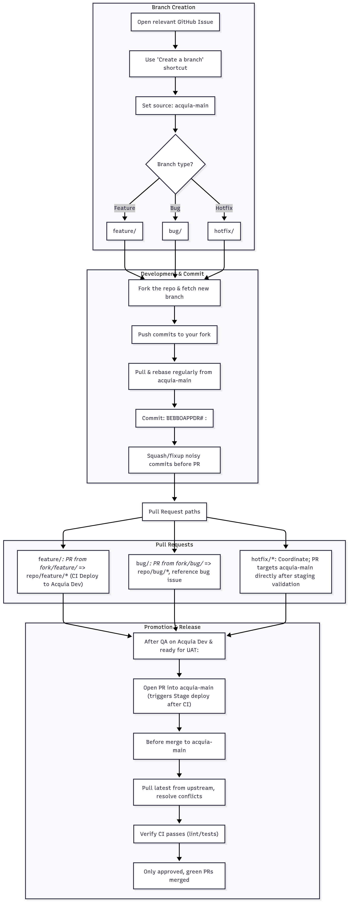

# [Bebbo](https://bebbo.app/) CMS - Drupal content management system

## Table of Contents
* [Introduction](#introduction)
* [Installation](#installation)
  * [Pre-requisites](#pre-requisites)
  * [Configuration](#configuration)
  * [Run the Application](#run-the-application)
  * [Local Configuration Management](#local-configuration-management)
* [Feature Setup](#feature-setup)
* [Documentation](#documentation)
* [CI/CD Security Practices](#cicd-security-practices)
* [Branching Strategy](#branching-strategy)
* [License](#license)
* [Maintainers](#maintainers)
* [Community](#community)

## Introduction
Bebbo CMS application is a headless implementation of Drupal 11 CMS where the content is added through the web interface and serves as REST APIs for a mobile app. This application assists editors in adding different types of content under various content types and taxonomies configured in Drupal CMS. Go through the [onboarding document](./docs/ONBOARDING.md) before continuing with the Installation guidelines below.

For more information on setup and getting started, check out our [guidelines for contributors](./CONTRIBUTING.md).

## Installation

### Pre-requisites
Before installing the Bebbo CMS application, ensure that you have the following software installed on your development machine:

- **DDEV with PHP 8.4 runtime**: The recommended local environment is [DDEV](https://docs.ddev.com/en/stable/) running PHP 8.4 with MariaDB 10.11. Install DDEV following the official instructions for your platform, making sure PHP 8.4 is selected in `.ddev/config.yaml` (or via `ddev config global --php-version 8.4`). The committed `.ddev/config.yaml` already pins `php_version: "8.4"`.
  - **Windows**: Requires Windows 10/11 Pro, [WSL2](https://learn.microsoft.com/windows/wsl/install), [Docker Desktop](https://www.docker.com/products/docker-desktop/), [mkcert](https://github.com/FiloSottile/mkcert) and the [DDEV Windows prerequisites](https://docs.ddev.com/en/stable/users/install/ddev-installation/#windows). Install mkcert via Chocolatey (`choco install mkcert`) and trust certificates with `mkcert -install`.
  - **macOS**: Install [Homebrew](https://brew.sh/), [Docker Desktop](https://www.docker.com/products/docker-desktop/) (or [Colima](https://docs.ddev.com/en/stable/users/install/docker-installation/#colima) on Apple Silicon), and mkcert (`brew install mkcert nss && mkcert -install`). Follow the [macOS DDEV guide](https://docs.ddev.com/en/stable/users/install/ddev-installation/#macos).
  - **Linux (Ubuntu/Debian)**: Install Docker Engine, Docker Compose, mkcert, and inotify tools per the [Linux setup guide](https://docs.ddev.com/en/stable/users/install/ddev-installation/#linux). For Ubuntu you can run `sudo apt install mkcert libnss3-tools` and then `mkcert -install`. Ensure your user is added to the `docker` group.
- **Composer**: [Composer Installation Guide](https://getcomposer.org/doc/00-intro.md#installation-linux-unix-osx). If you skip the global install, run Composer via `php composer.phar`.
- **Drush** (CLI helper): `composer global require drush/drush`.
- **Git**: Required to clone this repository.

### Configuration
After installing all the pre-requisites, follow the steps below to set up the Bebbo CMS:
For Windows users, before proceeding to the next step, run the following command:
```
git config --global core.longpaths true
```
1. Clone the repository from GitHub:
   ```
   git clone https://github.com/UNICEFECAR/parenting-app-bebbo-CMS
   cd parenting-app-bebbo-CMS
   ```
2. Start the existing DDEV environment (the `.ddev` directory is already committed):
   ```
   ddev start
   ```
   If you need to confirm URLs or container details, run `ddev describe`.
3. Install Composer dependencies inside the container:
   ```
   ddev composer install
   ```
4. Download the latest development database from the Acquia server and import it locally. If you do not have access to Acquia, you can download the latest development database dump from [here](https://drive.google.com/file/d/1SuBFYpNYARkHceyPoiLBWaa7zBAZfYsz/view).

   The development database is provided solely for local development and testing. It contains development content only and does **not** contain production personal data. It should never be used in production environments.
   ```
   ddev import-db --src=/path/to/bebbo.sql.gz
   ```
   For complete database setup, multisite configuration, and local environment instructions, see the [Runbook](docs/RUNBOOK.md).
5. Import public files if required:
   ```
   ddev import-files --src=/path/to/files.tar.gz
   ```
6. Review or adjust database credentials and other overrides in `docroot/sites/default/settings.php` or a `settings.local.php` include if your environment requires it (DDEV auto-injects settings via `settings.ddev.php`).
7. If DDEV fails to start, inspect the container logs with:
   ```
   ddev logs
   ```
### Multisite Setup

Under .ddev/mysql create a file name init-databases.sql

Copy the below content in init-databases.sql  file

```

-- Create multisite databases and grant privileges to the default DDEV user 'db'

CREATE DATABASE IF NOT EXISTS bangladesh_db;
GRANT ALL PRIVILEGES ON bangladesh_db.* TO 'db'@'%';

CREATE DATABASE IF NOT EXISTS turkey_db;
GRANT ALL PRIVILEGES ON turkey_db.* TO 'db'@'%';

CREATE DATABASE IF NOT EXISTS ecuador_db;
GRANT ALL PRIVILEGES ON ecuador_db.* TO 'db'@'%';

CREATE DATABASE IF NOT EXISTS pakistan_db;
GRANT ALL PRIVILEGES ON pakistan_db.* TO 'db'@'%';

CREATE DATABASE IF NOT EXISTS somoa_db;
GRANT ALL PRIVILEGES ON somoa_db.* TO 'db'@'%';

CREATE DATABASE IF NOT EXISTS zimbabwe_db;
GRANT ALL PRIVILEGES ON zimbabwe_db.* TO 'db'@'%';

FLUSH PRIVILEGES;
```

After copying the above content to file run below command
```
ddev mysql -uroot -proot < .ddev/mysql/init-databases.sql
```
Check mysql all the databases are be created or not.
```
ddev drush sql:query "show databases"
```
Using `ddev describe` , you find all the list of sites.

Download the databases from acquia cloud and import them to corresponding multi-site databases using below command.
```
ddev import-db --database=<multi-site-dbname> --file=<path-to-database.sql.gz>
```

### Run the Application
Launch the application in your browser to verify everything is set up correctly.
1. Start the container stack (`ddev start`) and open the site with `ddev launch`.
2. You can also list the site links with `ddev describe`. If running the installer from scratch, follow the standard Drupal steps (choose profile, enter DB credentials, etc.). When using the shared database dump this step is already completed—log in via `ddev drush uli`.
3. Complete any post-install configuration and confirm the Drupal homepage loads without errors. If you encounter startup issues, review logs via `ddev logs`.

### Local Configuration Management

All configuration synchronization is managed locally using Drush commands.
#### Check Pending Configuration Changes
Shows differences between the active configuration (database) and the configuration files in the sync directory.
```
ddev drush config:status
```

#### Import Configuration (YAML → Database)

Use this when you need to apply configuration from config/default into your local database:
```
ddev drush cim -y
ddev drush cr
```
#### Export Configuration (Database → YAML)

Use this when you make changes through the Drupal UI and need to update the configuration files:
```
ddev drush cex -y
ddev drush cr
```

## Feature Setup

Installing the codebase and importing configuration gets a site running, but several features ship inert: their structure is in Git while their credentials, endpoints and enrolment settings are supplied per environment. Configure these **after** setting up a new site — including each new country site — or the feature will silently do nothing.

Every step, form path, permission and verification check is documented in **[Post-Setup Configuration](docs/POST_SETUP_CONFIGURATION.md)**, which covers:

| Feature | Needs |
|---|---|
| AI / AI Translate (OpenAI) | An OpenAI API key in the Key module, plus TMGMT providers — no `tmgmt.translator.*` entity arrives via `cim` |
| Email TFA | Working outbound email first; it is globally enforced, uid 1 included |
| Outbound email (Microsoft 365) | An Entra ID app registration, a per-environment redirect URI, and a one-time delegated sign-in |
| Content Analytics | The BigQuery endpoint URL and its `X-API-Key`, plus cron |
| Entity Share | The `entity_share_basic_auth` key and a reachable remote |
| API security (JWT + device attestation) | `BEBBO_JWT_PRIVATE_KEY` (and optionally `BEBBO_GOOGLE_SA_KEY`) as environment variables; enforcement is `disabled` by default |

That document also carries the ordered [new-site checklist](docs/POST_SETUP_CONFIGURATION.md#8-new-site-checklist) — order matters, since email must work before TFA and keys must exist before the features that read them.

**No credential is ever committed.** Values are entered in admin forms or set as environment variables. One trap to note: `key.key.openai_api_key` is *not* in `config_ignore`, so a blanket `drush cex` after entering the OpenAI key will write the secret into `config/sync`. Export only the files your change touched.

## Documentation

The project documentation is organised under the `/docs` directory.

| Topic | Description |
|--------|-------------|
| [Architecture](docs/ARCHITECTURE.md) | Overall CMS architecture and system design |
| [Configuration](docs/CONFIGURATION.md) | Drupal configuration management |
| [Post-Setup Configuration](docs/POST_SETUP_CONFIGURATION.md) | What to configure after install: AI, MFA, analytics, mail, Entity Share, API security |
| [Environment Guide](docs/ENVIRONMENTS.md) | Development, Stage and Production environments |
| [Modules](docs/MODULES.md) | Custom modules and their purpose |
| [API Reference](docs/API_REFERENCE.md) | REST API endpoints |
| [API Security](docs/API_SECURITY.md) | Authentication and API security model |
| [CI/CD Deployment](docs/CICD_DEPLOYMENT.md) | Deployment pipeline and release process |
| [Dependencies](docs/DEPENDENCIES.md) | Third-party packages and services |
| [Runbook](docs/RUNBOOK.md) | Local development, deployment, operational procedures and troubleshooting |
| [Coding Standards](docs/CODING_STYLE_GUIDE.md) | Coding conventions and development standards |
| [Contributing Guide](CONTRIBUTING.md) | How to contribute to the project |
| [Code of Conduct](CODE_OF_CONDUCT.md) | Community participation guidelines |
| [Security Policy](SECURITY.md) | Reporting security vulnerabilities |
| [License](LICENSE) | GNU General Public License v3.0 |

### Additional Resources

- [Project Wiki](https://github.com/UNICEFECAR/parenting-app-bebbo-CMS/wiki) – Additional implementation notes, FAQs, and project-specific guidance.

## CI/CD Security Practices
The automated pipeline defined in [.github/workflows/pipelines.yml](.github/workflows/pipelines.yml) enforces several security measures that contributors should be aware of:

- **Credentials isolation**: Acquia API keys, SSH keys, and host fingerprints are consumed exclusively via encrypted GitHub Secrets (`ACQUIA_API_KEY_ID`, `ACQUIA_API_KEY_SECRET`, `ACQUIA_SSH_PRIVATE_KEY`, `ACQUIA_SSH_KNOWN_HOSTS`). Secrets are injected only into the relevant deploy jobs.
- **Hardening SSH connectivity**: The workflow provisions SSH access using `webfactory/ssh-agent` with the private key from secrets and explicitly pins the Acquia Git host fingerprint via `ssh-keyscan` before any remote interaction.
- **Clean build environments**: Every job starts from a fresh `ubuntu-latest` runner and pins PHP via `shivammathur/setup-php` — **PHP 8.4 in all three jobs** (`ci-checks`, `deploy-dev`, `deploy-stage`) — then performs `git reset --hard` / `git clean -fd` prior to artifact pushes to avoid leaking untracked files. This is the PHP version of the GitHub runner that builds and pushes the artifact; the PHP version each Acquia environment *runs* is set in Acquia Cloud and is not defined in this repository.
- **Dependency and code integrity checks**: `composer validate`, `composer install --no-interaction`, PHPCS, `drupal-check`, and `phplint` run on each push/PR to catch tampered dependencies or insecure code patterns before deployment.
- **Scoped deployments**: Deploy jobs only run for specific branches — a push to `develop` deploys to Acquia Dev, a push to `stage` deploys to Acquia Stage — after CI checks pass (`needs: ci-checks`), ensuring only vetted code can reach Acquia environments. `main` is not a deploy trigger; Prod is deployed manually.
- **Auditable automation account**: Git author identity for automated commits to Acquia Git is consistently set to `github-actions+bebbo@unicef.org`, making bot activity traceable in repository history.

## Branching Strategy
Follow these guidelines to keep work streams predictable and in sync with the Acquia environments. Deployments are driven by **branch pushes**, not by merges into `main`:

- Push to **`develop`** → deploys to **Acquia Dev** (`@parentbuddy2.dev`).
- Push to **`stage`** → deploys to **Acquia Stage** (`@parentbuddy2.test`).
- **`main` is not a deploy trigger.** Production is released manually (no automated job).

CI checks (`composer validate`, PHPCS, `drupal-check`, `phplint`) run on every push to `develop`/`stage` and on every PR targeting `feature/**`, `bug/**`, `hotfix/**`, `develop`, and `stage`.

1. **Create branches from issues**
   - Open the relevant GitHub issue and use the “Create a branch” shortcut in the bottom-right panel.
   - Set **Branch Source** to `develop`.
   - Use a descriptive name matching the work type:
     - `feature/<short-description>` for new features/enhancements.
     - `bug/<short-description>` for defects discovered during testing.
     - `hotfix/<short-description>` for urgent fixes targeting production/UAT.
2. **Develop**
   - Push commits to your working branch and open a PR against `develop`. CI runs on the PR.
   - Keep your branch in sync by regularly rebasing onto the latest `develop` to minimize conflicts.
3. **Commit hygiene**
   - Write meaningful commit messages using the convention `BEBBOAPPDR#<ticket-no> : <short description>`.
   - Squash/fixup locally if you created noisy commits before opening a PR.
4. **Pull requests by branch type**
   - **Feature / bug branches**: open a PR into `develop`. Once approved and merged, the push to `develop` deploys the build to Acquia Dev. Bug PRs should reference the bug issue and include any regression tests or reproduction steps.
   - **Hotfix branches**: coordinate with the release owner. Hotfix PRs also merge into `develop` (then promote through `stage`); only the release owner cuts production.
5. **Promotion to Stage**
   - After changes pass QA on Acquia Dev and are ready for UAT, open a PR from `develop` into `stage`. Merging it pushes `stage` and deploys to Acquia Stage.
6. **Release to Production**
   - Production is **not** deployed by any branch push. After Stage UAT sign-off, the release owner promotes the vetted build to Prod manually.
   - Before any promotion, pull the latest changes, resolve conflicts locally, and verify CI is green. Only approved, green PRs are merged.



## License

This project is licensed under the GNU General Public License v3.0 (GPL-3.0).

See the [LICENSE link](LICENSE) file for the complete license text.

## Maintainers
The Bebbo CMS is actively maintained by UNICEF (United Nations Children's Fund) in collaboration with various partners. It is part of the larger Bebbo project, a digital parenting platform aimed at providing parents and caregivers with essential early childhood development resources. Bebbo is a DPGA-recognized Digital Public Good.

For ongoing maintenance, please reach out to the following maintainers:
- [Saurabh Agarwal](https://github.com/saurabhEDU)
- [Neha Ruparel](https://github.com/neharuparel)

## Community
Unicef Bebbo has a friendly and lively open-source community. Our communication happens primarily primarily in our [Github Discussion](https://github.com/UNICEFECAR/parenting-app-bebbo-CMS/discussions) and we welcome all interested contributors to join the conversation.

## Contributors
We acknowledge the contributors who helped improve the project:
- [@Loveth Omokaro](https://github.com/Lovelyfin00)
- [@Osumgba Chiamaka](https://github.com/osumgbachiamaka)
