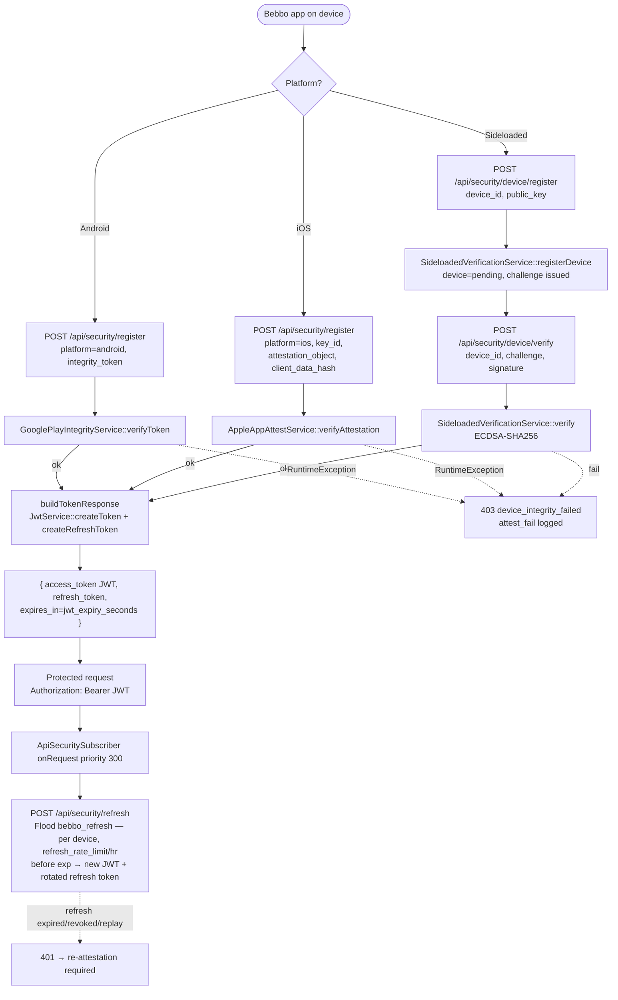
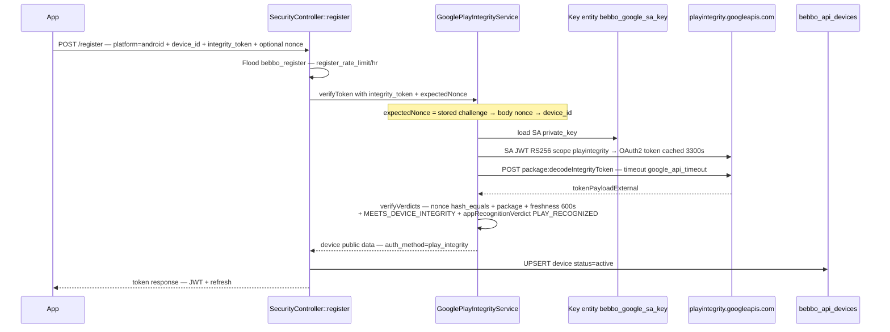
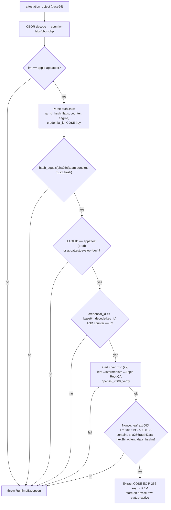
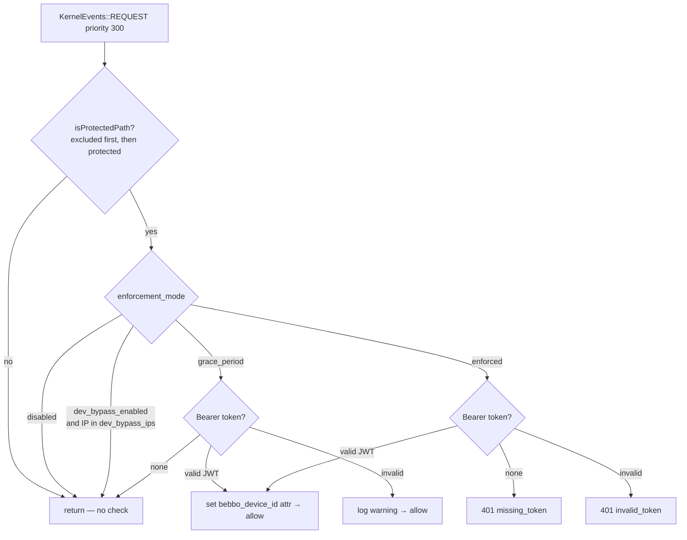

# Bebbo API Security — `bebbo_api_security`

> **Audience:** backend maintainers, mobile-integration engineers, security reviewers, operations.
> **Scope:** the `bebbo_api_security` custom module end-to-end — device attestation, JWT issuance/validation, request enforcement, data model, configuration, admin UI, and operations.
> **Verified against:** `docroot/modules/custom/bebbo_api_security/`, **verified 2026-07-03**. Every endpoint, field, default, and behavior below was read from the module source, not from prior documentation.
> **No GraphQL.** This module protects REST only. See `ARCHITECTURE.md`.

---

## 1. Purpose & Threat Model

The V2 content API (`/v2/api/*`) returns public content; without client authentication any scraper/bot could call it. This module adds **device authentication** so that only a genuine Bebbo build on a real device can obtain access:

1. The app proves authenticity via platform **attestation** (Apple App Attest / Google Play Integrity) or a **sideloaded** challenge-response.
2. On success the server issues a short-lived **JWT access token** and a long-lived **refresh token**.
3. The app sends `Authorization: Bearer <JWT>` on every protected request.
4. Tokens are refreshed before expiry; devices re-attest after the refresh token expires.

There are **no end-user accounts** — authentication is per device. The module is **backend-only**; the mobile team builds the client side.

> **Out of scope (related control):** this module guards the *read* API only. File-upload security — SVG sanitization and filename validation on CMS uploads — is a separate concern owned by the `file_sanitizer` module, not `bebbo_api_security`.

- **Module:** `docroot/modules/custom/bebbo_api_security/`
- **Info:** `name: Bebbo API Security`, `core_version_requirement: ^10 || ^11`, dependencies `drupal:key`, `drupal:views`, `view_custom_table:view_custom_table`.

---

## 1.1 Flow Diagrams

All diagrams below are derived from the verified source (`SecurityController`, the three verification services, `JwtService`, `ApiSecuritySubscriber`). They depict only behavior present at `HEAD`.

### Overview — attestation → token → protected request



### Android — Google Play Integrity



### iOS — Apple App Attest (offline)



### Sideloaded — EC P-256 challenge-response

```mermaid
sequenceDiagram
    participant App
    participant Ctrl as SecurityController
    participant SV as SideloadedVerificationService
    participant DB

    App->>Ctrl: POST /device/register — device_id + public_key PEM
    Ctrl->>Ctrl: Flood bebbo_device_register — per IP, device_register_ip_rate_limit/hr
    Ctrl->>SV: registerDevice()
    SV->>SV: validate EC prime256v1
    SV->>DB: UPSERT device=pending; insert challenge — random_bytes 32, TTL challenge_expiry_seconds
    SV-->>App: challenge 64-hex + expires_in
    App->>App: sign challenge bytes with device private key
    App->>Ctrl: POST /device/verify — device_id + challenge + signature
    Ctrl->>Ctrl: Flood bebbo_device_verify — per device, verify_rate_limit/hr
    Ctrl->>SV: verify()
    SV->>DB: lookup challenge by device+challenge+purpose; reject if used/expired
    SV->>SV: openssl_verify — SHA256 over challenge bytes with registered key
    SV->>DB: mark challenge used (regardless); on success device=active
    SV-->>App: success → token response | fail → 403
```

### Request enforcement decision (`ApiSecuritySubscriber`)



---

## 2. Composer Dependencies & Runtime Components

| Package | Constraint (`composer.json`) | Installed (`composer.lock`) | Role |
|---------|------------------------------|-----------------------------|------|
| `firebase/php-jwt` | `^7.0@stable` | `v7.1.0` | JWT encode/decode (RS256) — access tokens and the Google SA assertion |
| `spomky-labs/cbor-php` | `^3.0` | `3.2.3` | CBOR decode of Apple App Attest attestation/assertion objects |

Google Play Integrity is called directly via the core HTTP client (`@http_client` / Guzzle) — there is **no** `google/apiclient` dependency. Apple verification is fully offline (OpenSSL + the pasted Root CA) — no Apple SDK.

### 2.1 Everything used in the process

Beyond the two dedicated Composer packages, the module relies on the following — all confirmed from `composer.json`, `*.info.yml`, `*.services.yml`, and `use`/function references in `src/`:

| Component | Type | Where / how used |
|-----------|------|------------------|
| `firebase/php-jwt` `v7.1.0` | Composer lib | `Firebase\JWT\{JWT,Key,ExpiredException,SignatureInvalidException}` — RS256 JWT encode/decode (`JwtService`); also signs the Google SA assertion JWT (`GooglePlayIntegrityService`) |
| `spomky-labs/cbor-php` `3.2.3` | Composer lib | `CBOR\{Decoder,StringStream,CBORObject,Normalizable,Tag\TagManager,OtherObject\OtherObjectManager}` — decodes Apple App Attest attestation/assertion CBOR (`AppleAppAttestService`) |
| `drupal/key` `^1.22` | Contrib module dep | Key entities `bebbo_jwt_signing_key`, `bebbo_google_sa_key`; read at runtime via `key.repository` |
| `drupal/views` + `view_custom_table` | Contrib module dep | 4 admin Views over the custom tables (§10) |
| `ext-openssl` (PHP) | PHP extension | `openssl_x509_verify`, `openssl_pkey_get_{public,private,details}`, `openssl_verify` — Apple cert-chain + key derivation, sideloaded ECDSA verify, RSA public-key derivation for JWT |
| `GuzzleHttp\ClientInterface` (`@http_client`) | Drupal core service | Google OAuth2 token + `decodeIntegrityToken` HTTP calls (`GooglePlayIntegrityService`) |
| Flood (`@flood`) | Drupal core service | Per-event rate limiting on register / device-register / device-verify / refresh (§9, §11) |
| `key.repository` | Drupal `key` service | Loads the JWT signing key and Google SA JSON |
| `@config.factory` | Drupal core service | Reads `bebbo_api_security.settings` |
| `@database` | Drupal core service | CRUD on the 4 custom tables (`DeviceRegistryService`) |
| `logger.channel.bebbo_api_security` | Drupal logger channel (injected directly) | Audit + warning/error logging |
| PHP `time()` | PHP builtin | All Unix timestamps (created/updated/expires) — not the `@datetime.time` service |
| Symfony `Request` arg → `getClientIp()` | Controller method arg / kernel event | Client IP (Flood keys, dev-bypass) and request path — not the `@request_stack` service |
| PHP CSPRNG | PHP builtin | `random_bytes()` for JWT `jti`, refresh tokens, token families, sideloaded challenges; `hash('sha256', …)`, `hash_equals()` for token hashing + constant-time compares |

> The exact service wiring is in `bebbo_api_security.services.yml`; the external library `use` statements are in `src/Service/*`.

---

## 3. Module Anatomy

| File | Role |
|------|------|
| `src/Controller/SecurityController.php` | 5 public POST endpoints (register / device-register / device-verify / refresh / revoke) |
| `src/EventSubscriber/ApiSecuritySubscriber.php` | `KernelEvents::REQUEST` priority **300** — JWT enforcement on protected paths |
| `src/Service/JwtService.php` | JWT create/validate (RS256); refresh-token create/rotate/revoke + replay detection |
| `src/Service/GooglePlayIntegrityService.php` | Android — verify Play Integrity verdicts (calls Google) |
| `src/Service/AppleAppAttestService.php` | iOS — verify App Attest attestation offline; also provides an assertion verifier |
| `src/Service/SideloadedVerificationService.php` | Sideloaded — EC P-256 challenge-response |
| `src/Service/DeviceRegistryService.php` | DB CRUD for the 4 tables; cron purge; truncate-all |
| `src/Form/ApiSecuritySettingsForm.php` | Admin config UI + data-management buttons |
| `bebbo_api_security.module` | `hook_cron()` → purge expired data |
| `bebbo_api_security.routing.yml` | Routes (below) |
| `bebbo_api_security.services.yml` | Service + logger-channel definitions |
| `bebbo_api_security.install` | `hook_schema()` (4 tables) + `update_10001` (installs admin Views) |
| `bebbo_api_security.permissions.yml` | `administer bebbo api security` |
| `bebbo_api_security.links.menu.yml` / `.links.task.yml` | Admin menu link + 5 local-task tabs |
| `config/schema/bebbo_api_security.schema.yml` | Config schema for all settings |
| `config/install/bebbo_api_security.settings.yml` | Default settings |
| `config/install/key.key.bebbo_jwt_signing_key.yml` | Key entity — JWT private key (env) |
| `config/install/key.key.bebbo_google_sa_key.yml` | Key entity — Google SA JSON (env) |
| `config/install/views.view.bebbo_api_{devices,refresh_tokens,security_log,challenges}.yml` | 4 admin Views (via `view_custom_table`) |
| `tests/src/Unit/*`, `tests/src/Kernel/*` | 3 Unit + 5 Kernel test classes |

### Services (`bebbo_api_security.services.yml`)

`bebbo_api_security.device_registry`, `.jwt_service`, `.google_play_integrity`, `.apple_app_attest`, `.sideloaded_verification`, `.request_subscriber` (tagged `event_subscriber`), and `logger.channel.bebbo_api_security`.

---

## 4. Endpoints

All registration/token endpoints are **POST**, `_access: 'TRUE'` (public), `no_cache: TRUE`, under `/api/security/`. Source: `bebbo_api_security.routing.yml` + `SecurityController`.

| Route | Path | Controller method | Auth at route | Platform |
|-------|------|-------------------|---------------|----------|
| `bebbo_api_security.register` | `/api/security/register` | `register()` | public | Android / iOS |
| `bebbo_api_security.device_register` | `/api/security/device/register` | `deviceRegister()` | public | Sideloaded (step 1) |
| `bebbo_api_security.device_verify` | `/api/security/device/verify` | `deviceVerify()` | public | Sideloaded (step 2) |
| `bebbo_api_security.refresh` | `/api/security/refresh` | `refresh()` | public | All |
| `bebbo_api_security.revoke` | `/api/security/revoke` | `revoke()` | public route, **Bearer JWT required in handler** | All |
| `bebbo_api_security.settings` | `/admin/config/parent-buddy/api-security` | `ApiSecuritySettingsForm` | `_permission: administer bebbo api security`, `_admin_route` | Admin |

> The `revoke` route is `_access: TRUE`, but `revoke()` itself reads the `Authorization: Bearer` header and returns 401 if the JWT is missing/invalid before doing anything.

### 4.1 `POST /api/security/register` — Android / iOS attestation

Required body: `platform` (`android`|`ios`), `device_id`. Rate limit: `register_rate_limit` per `device_id` per hour (default 10) via Flood (`bebbo_register`).

- **Android** also requires `integrity_token`. Optional `nonce`. The controller computes the expected nonce as: server-stored active challenge (from `device/register`) if present, else the body `nonce`, else `NULL`, and passes it to `GooglePlayIntegrityService::verifyToken()`. The **service** then substitutes `device_id` when that argument is `NULL` (`verifyToken()`). Net effective priority: stored challenge → body nonce → `device_id`. `auth_method = play_integrity`.
- **iOS** also requires `key_id`, `attestation_object`, `client_data_hash`. Calls `AppleAppAttestService::verifyAttestation()` which returns the device public key (stored). `auth_method = app_attest`.
- On success: device UPSERTed (`status: active`), `register` logged, token response returned ([§4.6](#46-success-token-response)).
- On `\RuntimeException`: `attest_fail` logged; returns **403** `{status: rejected, reason: device_integrity_failed, message}`.
- Invalid platform → **400** `invalid_platform`.

### 4.2 `POST /api/security/device/register` — Sideloaded step 1

Required body: `device_id`, `public_key`. Rate limit: `device_register_ip_rate_limit` per client **IP** per hour (default 5; event `bebbo_device_register`). Calls `SideloadedVerificationService::registerDevice()` (validates EC P-256, stores device as `pending`, issues challenge). Returns `{status: challenge_issued, challenge: <64-hex>, expires_in: <challenge_expiry_seconds>}`. Invalid key → **400** `invalid_key`.

### 4.3 `POST /api/security/device/verify` — Sideloaded step 2

Required body: `device_id`, `challenge`, `signature`. Rate limit: `verify_rate_limit` per `device_id` per hour (default 10; event `bebbo_device_verify`). Calls `SideloadedVerificationService::verify()` (ECDSA-SHA256 over the challenge bytes). On success: device → `active`, `register` logged, token response. Failure → **403** (`verification_failed` or `signature_invalid`); `attest_fail` logged.

### 4.4 `POST /api/security/refresh` — Token refresh

Required body: `refresh_token`. Rate limit: `refresh_rate_limit` per hour (default 30; event `bebbo_refresh`), keyed on the **device** that owns the presented token — resolved by `JwtService::getDeviceIdForRefreshToken()`, which matches on token hash alone so revoked and expired tokens still count against their device's budget. Tokens matching no stored row fall back to the client **IP**. Then calls `JwtService::refreshTokens()`. Success → `{status: refreshed, access_token, token_type: Bearer, expires_in, refresh_token}`. Failure (expired/revoked/replay) → **401** `{status: invalid, message: "Refresh token expired or revoked. Re-attestation required."}`.

### 4.5 `POST /api/security/revoke` — Logout / revoke

Requires `Authorization: Bearer <JWT>`. Validates the JWT, takes `sub` (device_id), calls `JwtService::revokeTokensForDevice()` (sets `revoked = 1` on all that device's active refresh tokens), logs `revoke`. Returns `{status: revoked}`. Missing token → 401 `missing_token`; invalid → 401 `invalid_token`.

### 4.6 Success token response

`SecurityController::buildTokenResponse()` returns:

```json
{
  "status": "verified",
  "access_token": "<JWT>",
  "token_type": "Bearer",
  "expires_in": 3600,
  "refresh_token": "<opaque 64-hex>"
}
```

`expires_in` = `jwt_expiry_seconds` (default 3600). Common error envelopes: `400` `{error, message}` for invalid JSON / missing field; `429` `{error: rate_limited, message}` when Flood trips.

---

## 5. Request Enforcement (`ApiSecuritySubscriber`)

Subscribes to `KernelEvents::REQUEST` at **priority 300**. Flow (`onRequest()`):

1. If `path` is not protected (see matching below) → return (no checking).
2. Read `enforcement_mode` (default `disabled`).
3. `disabled` → return immediately.
4. If `dev_bypass_enabled` and client IP ∈ `dev_bypass_ips` → return (skip).
5. Extract Bearer token. Then by mode:

| Mode | No token | Valid JWT | Invalid/expired JWT |
|------|----------|-----------|---------------------|
| `disabled` (default) | allow | allow | allow |
| `grace_period` | allow (silent) | allow + set `bebbo_device_id` request attr | allow, **warning logged** |
| `enforced` | **401** `missing_token` | allow + set `bebbo_device_id` request attr | **401** `invalid_token` |

401 responses are JSON `{error, error_description}` with header `WWW-Authenticate: Bearer realm="Bebbo API"`.

### 5.1 Path matching (`isProtectedPath`)

Both pattern lists are newline-separated regex prefixes, matched as `#^<pattern>#` against `$request->getPathInfo()`:

- **Excluded patterns are checked first** — a match means *not protected* (short-circuits).
- Then **protected patterns** — a match means protected.
- No match in either → not protected.

Defaults (`config/install/bebbo_api_security.settings.yml`):

```yaml
protected_api_patterns: "/v2/api/"
excluded_api_patterns:  "/api/security/"
```

So out of the box: **`/v2/api/*` is protected (this covers `/v2/api/check-update/`); `/api/security/*` is excluded (token-issuance endpoints must be reachable without a JWT); the V1 `/api/*` endpoints — content *and* the public `/api/check-update/` — are NOT protected.** Editable in the admin form (each line is validated as a regex).

> The `/api/check-update/` pattern is deliberately absent from the protected set; `isProtectedPath()` start-anchors each pattern, so including it would JWT-gate the public V1 `/api/check-update/` path. The V2 path stays protected via the `/v2/api/` prefix.

Rollout: `disabled` → `grace_period` (monitor) → `enforced`. Rollback is a config flip, no deploy.

### 5.2 Page-cache exclusion on `/v2/api/check-update/` (`no_cache: TRUE`)

The subscriber runs at `KernelEvents::REQUEST` priority **300**, but Drupal's internal **page-cache middleware runs earlier**, before the kernel dispatches that event — so any JWT-gated response stored in the page cache would be served without ever reaching the subscriber.

The **V2** check-update route is therefore marked `no_cache: TRUE`, so the page-cache middleware never stores or serves it; every request falls through to the kernel and the subscriber enforces JWT. The **V1** route stays page-cacheable because it is public by design (it carries no `options`).

```yaml
# bebbo_serializer.routing.yml
bebbo_serializer.v1_check_update:        # /api/check-update/{country}
  requirements: { _access: 'TRUE' }      # public, no options → page-cacheable
bebbo_serializer.v2_check_update:        # /v2/api/check-update/{country}
  requirements: { _access: 'TRUE' }      # public route; JWT enforced by subscriber
  options:
    no_cache: TRUE                        # JWT-gated: never page-cache
```

The same `no_cache: TRUE` guard is set on all five `/api/security/*` routes (§4): they are excluded from JWT enforcement, but each issues per-device tokens and must never be cached.

---

## 6. JWT (`JwtService`)

- **Algorithm:** RS256 (`firebase/php-jwt`).
- **Access token payload** (`createToken`): `iss: "bebbo-cms"`, `sub: <device_id>`, `iat`, `exp` (= now + `jwt_expiry_seconds`), `platform`, `auth_method`, `jti` (`bin2hex(random_bytes(16))`).
- **Signing key:** loaded from Key entity `bebbo_jwt_signing_key`; throws if the key is missing or empty. The RSA **public key is derived from the private key** at runtime via OpenSSL (not stored separately).
- **Validation** (`validateToken`): decodes with the derived public key; returns the payload array, or `NULL` on `ExpiredException` (silent), `SignatureInvalidException` (warning logged), or any other exception (warning logged).

### 6.1 Refresh tokens

- **Creation** (`createRefreshToken`): raw = `bin2hex(random_bytes(32))` (64 hex chars); a `token_family` = another 32 random bytes; only the **SHA-256 hash** of the raw token is stored (`bebbo_api_refresh_tokens`). The raw token is returned to the app once. Expiry = `refresh_expiry_seconds` (default 2592000 = 30 d).
- **Rotation + replay detection** (`refreshTokens`): look up by SHA-256 hash.
  - Not found → `NULL`.
  - **Already revoked → revoke the entire `token_family`, log an error ("replay detected"), return `NULL`.** (Stolen-token reuse kills the whole session lineage.)
  - Expired → `NULL`.
  - Device row missing → `NULL` (checked **before** any token mutation, so a failed refresh never leaves an orphaned rotated token).
  - Otherwise, gated by **`refresh_rotation_enabled`** (default `true`):
    - **`true` (rotate):** revoke the presented token, insert a new one in the **same family**, mint a fresh JWT, return `{access_token, refresh_token: <new>, expires_in}`.
    - **`false` (no rotation):** leave the presented token unchanged (still valid until its own expiry), mint a fresh JWT, return `{access_token, refresh_token: <same as presented>, expires_in}`. Note: with rotation off, family-based replay detection only triggers on explicitly revoked tokens, since refresh no longer revokes.
- **Revoke all for device** (`revokeTokensForDevice`): sets `revoked = 1` on all non-revoked tokens for that `device_id`; returns the count.

---

## 7. Verification Flows

### 7.1 Android — Google Play Integrity (`GooglePlayIntegrityService`)

1. Requires `google_package_name` configured (throws otherwise).
2. Obtains a Google OAuth2 access token by signing a service-account JWT (scope `https://www.googleapis.com/auth/playintegrity`, RS256) using the SA `private_key` from Key entity `bebbo_google_sa_key`; the access token is cached for **3300 s** (55 min).
3. `POST https://playintegrity.googleapis.com/v1/{package}:decodeIntegrityToken` with the app's `integrity_token` (timeout `google_api_timeout`, default 10 s).
4. **Verdict checks** (`verifyVerdicts`) against `tokenPayloadExternal`:
   - **Nonce:** `hash_equals(expected, requestDetails.nonce)` — `expected` is the server-stored challenge, else body `nonce`, else `device_id`. Compared verbatim (no hashing).
   - **Package:** `requestDetails.requestPackageName` must equal `google_package_name`.
   - **Freshness:** `requestDetails.timestampMillis` within `google_verdict_freshness_seconds` (default 600) of now.
   - **Device:** `deviceIntegrity.deviceRecognitionVerdict` must include `MEETS_DEVICE_INTEGRITY`.
   - **App:** `appIntegrity.appRecognitionVerdict` must be `PLAY_RECOGNIZED`; if `google_allow_unrecognized_version` is on, `UNRECOGNIZED_VERSION` is also accepted (logs a warning on every use — dev/testing only).

### 7.2 iOS — Apple App Attest (`AppleAppAttestService::verifyAttestation`)

Offline, no server secret. Steps:

1. Base64-decode then CBOR-decode the attestation object. `fmt` must be `apple-appattest`.
2. Parse `authData`: `rp_id_hash`, `flags`, `counter`, `aaguid`, `credential_id`, COSE key bytes.
3. **RP ID hash:** `hash_equals(sha256("{apple_team_id}.{apple_bundle_id}"), rp_id_hash)`.
4. **AAGUID:** must equal `appattest\0\0\0\0\0\0\0` when `apple_production_mode` is on, else `appattestdevelop`.
5. **Credential ID** must equal `base64_decode(key_id)`; **counter** must be `0`.
6. **Cert chain** (`x5c`, ≥2 certs): leaf signed by intermediate, intermediate signed by the **Apple Root CA** pasted into config (`apple_root_ca_pem`; throws if unset). Uses `openssl_x509_verify`.
7. **Nonce:** leaf cert extension OID `1.2.840.113635.100.8.2` must contain `sha256(authData . hex2bin(client_data_hash))` (last 32 bytes).
8. Extract the COSE EC P-256 public key → PEM, store on the device row.

### 7.3 Sideloaded — challenge-response (`SideloadedVerificationService`)

- **Step 1 `registerDevice`:** validate the submitted PEM is EC P-256 (`prime256v1`); UPSERT device as `pending`; insert a `sideloaded_verify` challenge (`bin2hex(random_bytes(32))`, expiry `challenge_expiry_seconds`, default 120); return the challenge.
- **Step 2 `verify`:** look up the challenge by `device_id`+`challenge`+purpose; reject if used/expired; `openssl_verify(hex2bin(challenge), base64_decode(signature), public_key, SHA256)`; **mark the challenge used regardless of outcome**; on success set device `active`.

---

## 8. Data Model

Four tables created by `hook_schema()` (`bebbo_api_security.install`).

### `bebbo_api_devices` — registered devices
`id` (serial PK) · `device_id` varchar(255, unique) · `platform` varchar(16) · `auth_method` varchar(32) · `public_key` text(medium, null) · `apple_key_id` varchar(128, null) · `apple_receipt` blob(big, null) · `apple_counter` int(unsigned, default 0) · `status` varchar(16, default `active`) · `created` int · `updated` int. Indexes: device+platform, apple_key_id, status.

### `bebbo_api_refresh_tokens` — hashed tokens
`id` (serial PK) · `device_id` varchar(255) · `token_hash` varchar(64, unique) · `token_family` varchar(64) · `expires` int · `revoked` tinyint(default 0) · `created` int. Indexes: device+expires, family.

### `bebbo_api_challenges` — single-use nonces
`id` (serial PK) · `device_id` varchar(255) · `challenge` varchar(64, unique) · `purpose` varchar(32) · `expires` int · `used` tinyint(default 0) · `created` int. Index: device+purpose.

### `bebbo_api_security_log` — audit trail
`id` (serial PK) · `device_id` varchar(255, null) · `event_type` varchar(32) · `details` text(medium, null; JSON) · `ip_address` varchar(45) · `created` int. Indexes: event_type, created. Event types seen in code: `register`, `attest_fail`, `revoke`.

### Device re-registration is an UPSERT
`DeviceRegistryService::registerDevice()` deletes the device's existing refresh tokens and challenges, preserves the original `created`, and merges the new fields.

---

## 9. Configuration

Config object `bebbo_api_security.settings` (schema in `config/schema/`, defaults in `config/install/`). Admin form groups these into: Enforcement, Google Play Integrity, Apple App Attest, Token Lifetimes, Rate Limiting, Operations, API Protection, Data Management.

| Key | Default | Form validation range | Used by |
|-----|---------|----------------------|---------|
| `enforcement_mode` | `disabled` | disabled/grace_period/enforced | Subscriber |
| `dev_bypass_enabled` | `false` | — | Subscriber |
| `dev_bypass_ips` | `''` | each line a valid IP | Subscriber |
| `debug_logging` | `false` | — | Google/Apple/controller debug logs |
| `google_package_name` | `''` | — | Play Integrity |
| `google_project_number` | `''` | — | Admin form (operational reference) |
| `google_verdict_freshness_seconds` | `600` | 60–3600 | Play Integrity |
| `google_api_timeout` | `10` | 5–30 | Play Integrity HTTP |
| `google_allow_unrecognized_version` | `false` | — | Play Integrity app verdict |
| `apple_team_id` | `''` | `^[A-Z0-9]{10}$` | App Attest |
| `apple_bundle_id` | `''` | — | App Attest |
| `apple_production_mode` | `true` | — | App Attest AAGUID |
| `apple_root_ca_pem` | `''` | must contain `-----BEGIN CERTIFICATE-----` | App Attest chain |
| `jwt_expiry_seconds` | `3600` | 300–86400 | JWT |
| `refresh_expiry_seconds` | `2592000` | 86400–7776000 | Refresh token |
| `refresh_rotation_enabled` | `true` | — | Refresh — `true` rotates the refresh token, `false` reuses it (`JwtService::refreshTokens()`) |
| `register_rate_limit` | `10` | 1–100 | `/register` Flood |
| `device_register_ip_rate_limit` | `5` | 1–50 | `/device/register` Flood |
| `verify_rate_limit` | `10` | 1–100 | `/device/verify` Flood |
| `refresh_rate_limit` | `30` | 1–200 | `/refresh` Flood |
| `challenge_expiry_seconds` | `120` | 30–600 | Sideloaded challenge TTL |
| `revoked_token_retention_days` | `7` | 1–90 | Cron purge |
| `security_log_max_entries` | `10000` | 1000–100000 | Cron/purge trim |
| `protected_api_patterns` | `/v2/api/` | each line valid regex | Subscriber |
| `excluded_api_patterns` | `/api/security/` | each line valid regex | Subscriber |

### 9.1 Keys & secrets (never committed)

| Key entity | Provider | Env var | Contents |
|------------|----------|---------|----------|
| `bebbo_jwt_signing_key` | `env`, `base64_encoded: true` | `BEBBO_JWT_PRIVATE_KEY` | RSA private key (PEM) — signs JWTs; public key derived. **Required** for any token issuance/validation. |
| `bebbo_google_sa_key` | `env`, `base64_encoded: true` | `BEBBO_GOOGLE_SA_KEY` | Google service-account JSON — Android Play Integrity only. |

Apple needs **no** server secret — only the Root CA PEM pasted into config (`apple_root_ca_pem`). Set env vars per environment (e.g. Acquia env vars); the Key module reads them at runtime.

---

## 10. Admin UI

- **Route:** `/admin/config/parent-buddy/api-security`, permission `administer bebbo api security` (`restrict access: true`).
- **Menu link:** under **Parent Buddy** (`parent: pb_custom_form.admin_config_parent_buddy`, weight 110).
- **Local-task tabs** (`bebbo_api_security.links.task.yml`): **Settings**, **Devices**, **Tokens**, **Security Log**, **Challenges**. The four data tabs are Views (`view.bebbo_api_devices.page_1`, `view.bebbo_api_refresh_tokens.page_1`, `view.bebbo_api_security_log.page_1`, `view.bebbo_api_challenges.page_1`) built on the custom tables via `view_custom_table`.
- **Data Management buttons:** *Purge Expired Data* (`DeviceRegistryService::purgeExpired()`) and *Truncate All Security Tables* (`truncateAll()`, JS-confirmed, irreversible).
- The admin Views are installed from `config/install/`; `bebbo_api_security_update_10001()` re-installs them on existing sites.

---

## 11. Operations

- **Cron** (`bebbo_api_security_cron`): calls `purgeExpired()` — deletes expired challenges, revoked refresh tokens older than `revoked_token_retention_days`, expired refresh tokens, and trims `bebbo_api_security_log` to `security_log_max_entries`. Logs a summary when anything was purged.
- **Manual purge / truncate:** via the admin form buttons (same service methods).
- **Rate limiting:** Drupal Flood API. `429` on exceed. Per-event keys/limits in [§9](#9-configuration).

---

## 12. Tests

PHPUnit tests ship with the module (`tests/src/`):

- **Unit (3):** `ApiSecuritySubscriberTest`, `GooglePlayIntegrityServiceTest`, `AppleAppAttestServiceTest`.
- **Kernel (5):** `ApiSecuritySubscriberIntegrationTest`, `DeviceRegistryServiceTest`, `JwtServiceTest`, `SecurityControllerTest`, `SideloadedVerificationServiceTest`.

Run with core's PHPUnit against the module's test group. The **sideloaded** flow is fully exercisable end-to-end without external services (you generate the EC P-256 key pair locally).

---

## 13. Error Response Reference

All security endpoints return **real HTTP status codes** (unlike the content API which embeds status in the JSON body). Response shapes vary between the subscriber (RFC 6750) and controller endpoints.

### 13.1 Request enforcement errors (`ApiSecuritySubscriber`)

These apply to **protected paths** (`/v2/api/*`, which covers `/v2/api/check-update/`) when `enforcement_mode` is `enforced`. All include the `WWW-Authenticate: Bearer realm="Bebbo API"` header.

| HTTP Status | Response body | Condition |
|-------------|---------------|-----------|
| **401** | `{"error": "missing_token", "error_description": "A valid JWT token is required to access this resource."}` | No `Authorization: Bearer` header on request |
| **401** | `{"error": "invalid_token", "error_description": "The provided JWT token is invalid or expired."}` | JWT expired, bad signature, or malformed |

> Expired and invalid tokens produce the same `invalid_token` error — no distinct code for expired. In `grace_period` mode, invalid tokens log a warning but the request passes through. In `disabled` mode, no JWT checking occurs.

### 13.2 Registration & attestation errors (`SecurityController`)

#### Input validation (all endpoints)

| HTTP Status | Response body | Condition |
|-------------|---------------|-----------|
| **400** | `{"error": "invalid_json", "message": "Request body must be valid JSON."}` | `json_decode` fails on request body |
| **400** | `{"error": "missing_field", "message": "Field '{field}' is required."}` | Required field missing or empty |
| **429** | `{"error": "rate_limited", "message": "Too many requests. Try again later."}` | Flood threshold exceeded |

Rate limits (per hour, via Drupal Flood API):

| Endpoint | Flood event | Default limit | Keyed by |
|----------|-------------|---------------|----------|
| `/api/security/register` | `bebbo_register` | 10 | `device_id` |
| `/api/security/device/register` | `bebbo_device_register` | 5 | client IP |
| `/api/security/device/verify` | `bebbo_device_verify` | 10 | `device_id` |
| `/api/security/refresh` | `bebbo_refresh` | 30 | `device_id` owning the token; client IP if it matches none |

#### Platform attestation (`/api/security/register`)

| HTTP Status | Response body | Condition |
|-------------|---------------|-----------|
| **400** | `{"error": "missing_field", "message": "integrity_token is required for Android."}` | Android: no `integrity_token` |
| **400** | `{"error": "missing_field", "message": "{field} is required for iOS."}` | iOS: missing `key_id`, `attestation_object`, or `client_data_hash` |
| **400** | `{"error": "invalid_platform", "message": "Platform must be android or ios."}` | `platform` not `android` or `ios` |
| **403** | `{"status": "rejected", "reason": "device_integrity_failed", "message": "<detail>"}` | Play Integrity or App Attest verification throws `RuntimeException` |
| **200** | `{"status": "verified", "access_token": "...", "token_type": "Bearer", "expires_in": 3600, "refresh_token": "..."}` | Attestation successful |

#### Sideloaded registration (`/api/security/device/register`)

| HTTP Status | Response body | Condition |
|-------------|---------------|-----------|
| **400** | `{"error": "invalid_key", "message": "<detail>"}` | PEM not a valid EC P-256 key |
| **200** | `{"status": "challenge_issued", "challenge": "<64-hex>", "expires_in": 120}` | Challenge issued successfully |

#### Sideloaded verification (`/api/security/device/verify`)

| HTTP Status | Response body | Condition |
|-------------|---------------|-----------|
| **403** | `{"status": "rejected", "reason": "verification_failed", "message": "<detail>"}` | Challenge not found, expired, or already used |
| **403** | `{"status": "rejected", "reason": "signature_invalid", "message": "Challenge signature verification failed."}` | ECDSA signature verification returns false |
| **200** | `{"status": "verified", "access_token": "...", "token_type": "Bearer", "expires_in": 3600, "refresh_token": "..."}` | Verification successful |

#### Token refresh (`/api/security/refresh`)

| HTTP Status | Response body | Condition |
|-------------|---------------|-----------|
| **401** | `{"status": "invalid", "message": "Refresh token expired or revoked. Re-attestation required."}` | Token not found, expired, revoked, device deleted, or replay detected |
| **200** | `{"status": "refreshed", "access_token": "...", "token_type": "Bearer", "expires_in": 3600, "refresh_token": "..."}` | Refresh successful (token rotated if `refresh_rotation_enabled`) |

> **Replay detection:** Reusing a revoked refresh token causes the server to revoke the **entire token family** (all tokens in the same rotation chain) and log `"Refresh token replay detected for device @device, family @family"`. The client receives the same 401 `{status: "invalid"}` response — there is no distinct replay error code visible to the client.

#### Token revocation (`/api/security/revoke`)

| HTTP Status | Response body | Condition |
|-------------|---------------|-----------|
| **401** | `{"error": "missing_token", "message": "Authorization header required."}` | No `Authorization: Bearer` header |
| **401** | `{"error": "invalid_token", "message": "Invalid or expired JWT."}` | JWT validation fails |
| **200** | `{"status": "revoked"}` | All device refresh tokens revoked |

### 13.3 Response shape summary

The module uses **two different 401 response shapes** depending on where the rejection occurs:

| Source | Error key | Detail key | `WWW-Authenticate` header |
|--------|-----------|------------|---------------------------|
| `ApiSecuritySubscriber` (middleware) | `error` | `error_description` (RFC 6750) | Yes |
| `SecurityController` (endpoints) | `error` or `status` | `message` | No |

---

## 14. Verify

```bash
ddev drush en bebbo_api_security -y && ddev drush cr
# 4 tables present
ddev drush sql-query "SHOW TABLES LIKE 'bebbo_api%'"
# JWT signing key resolves (env var set + Key entity present)
ddev drush ev "echo \Drupal::service('key.repository')->getKey('bebbo_jwt_signing_key')->getKeyValue() ? 'KEY OK' : 'EMPTY';"
# Enforcement mode + protected patterns
ddev drush config:get bebbo_api_security.settings enforcement_mode
ddev drush config:get bebbo_api_security.settings protected_api_patterns
# Routes registered
ddev drush ev "\$r=\Drupal::service('router.route_provider'); foreach(['bebbo_api_security.register','bebbo_api_security.refresh','bebbo_api_security.revoke'] as \$n){ echo \$n.' => '.\$r->getRouteByName(\$n)->getPath().PHP_EOL; }"
```