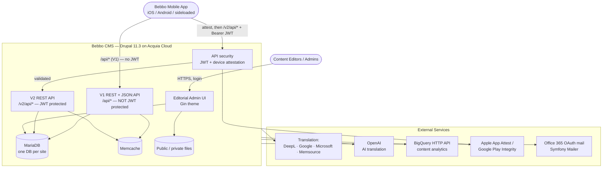
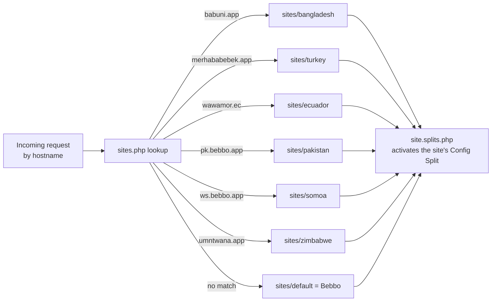
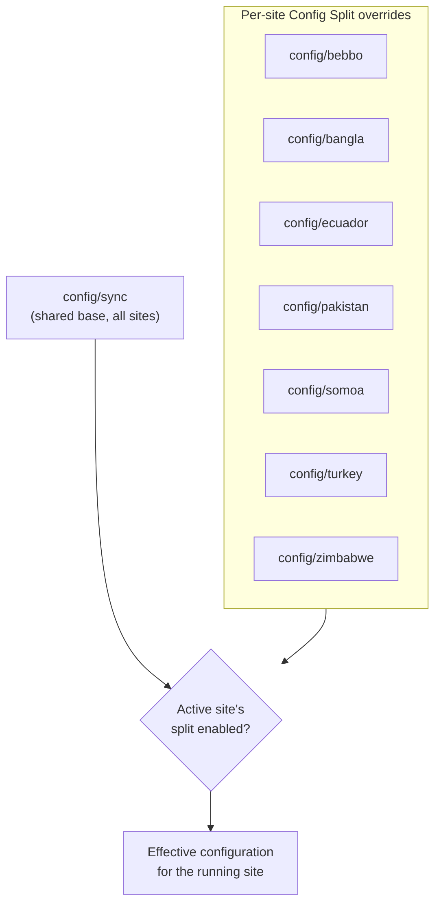
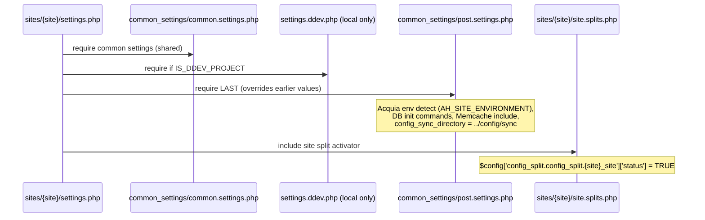
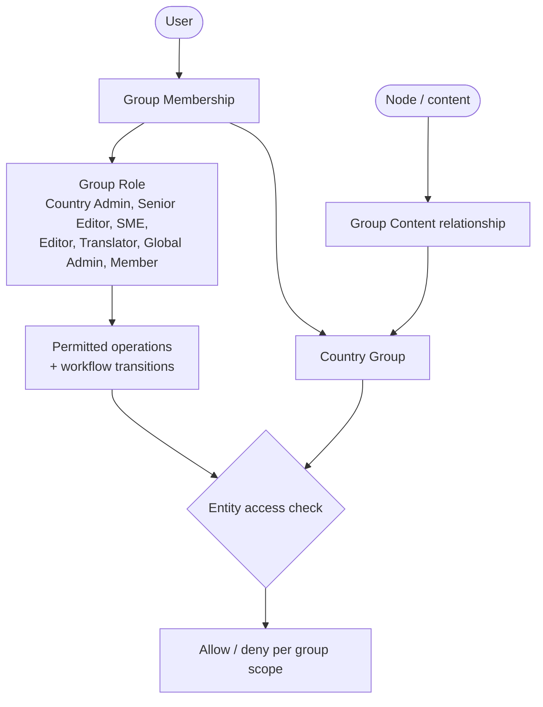
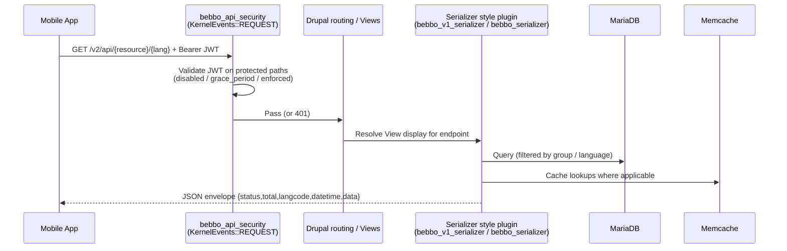

# Bebbo CMS — System Architecture & Solution Overview

> **Audience:** new developers, maintainers, support, and operations.
> **Scope:** high-level architecture, multisite topology, configuration layering, request/serving flow, and access model. Deep dives live in the sibling docs referenced throughout.
> **Verified 2026-07-03.** All version numbers and structural facts below were read directly from the codebase, not copied from older documentation.

---

## 1. What Bebbo Is

Bebbo (a.k.a. *Parent Buddy*) is the **headless Drupal CMS** behind UNICEF's parenting mobile app. Editors author content (articles, activities, videos, milestones, quizzes, courses, taxonomies, etc.) through the Drupal admin UI; the mobile app consumes that content over **HTTP REST APIs**. There is no public-facing HTML site — the only browser UI is the editorial/admin interface.

| Property | Value | Source |
|----------|-------|--------|
| Drupal core | **11.3.13** | `composer.lock` (`drupal/core`) |
| PHP | **>= 8.4** | `composer.json` `require.php`; DDEV `php_version: "8.4"` |
| Database | MariaDB local (DDEV; **10.11**); MySQL on Acquia Cloud | `.ddev/config.yaml`; `ENVIRONMENTS.md` |
| CLI tooling | **Drush ^13** | `composer.json` |
| Admin theme | **Gin** (`drupal/gin ^5.0`) | `config/sync/system.theme.yml` |
| Default theme | **Gin** (headless — no separate frontend theme) | `config/sync/system.theme.yml` |
| Hosting | **Acquia Cloud** — application `parentbuddy2` | `drush/sites/parentbuddy2.site.yml`, `hooks/`, `README.acquia` |
| Caching | Memcache (Acquia) for Drupal bins; Varnish + Acquia Platform CDN in front, purged via `acquia_purge`; V1 API kept warm by the `bebbo_custom_general` warmer on an Acquia scheduled job | `acquia/memcache-settings`, `docroot/sites/common_settings/cloud-memcache-d8+.php`, `config/sync/purge.plugins.yml`, `config/sync/bebbo_custom_general.warmer.yml` |
| Local dev | DDEV (`bebbo.app`) | `.ddev/` |
| Architecture | Single codebase, **7-site Drupal multisite**, per-site config via Config Split | `docroot/sites/`, `config/` |

> **Note on themes:** `system.theme.yml` currently sets **both** `admin: gin` and `default: gin`. Older documentation that states the default/front theme is Claro is out of date. Because the platform is headless, the "default" theme only affects the editorial login/error pages.

---

## 2. System Context

How the CMS sits between editors, the mobile app, and external services.



External integrations are enabled in `composer.json` and described in detail in **`DEPENDENCIES.md`**. API security details live in **`API_SECURITY.md`**; the REST surface in **`API_REFERENCE.md`**.

> **No GraphQL.** The project exposes **REST** (custom serializers — V1 under `/api/…`, V2 under `/v2/api/…`) and **JSON:API** (`jsonapi` + `jsonapi_extras`, both enabled). There is no GraphQL module in `composer.json`, `composer.lock`, or `docroot/modules/contrib`. The V2 API is protected by the `bebbo_api_security` JWT layer (see `API_SECURITY.md`).
>
> Note: `simple_oauth` and `consumers` are present in `composer.json` but **not** enabled in committed config (`core.extension.yml`), so OAuth is not an active auth path at `HEAD`.

---

## 3. Multisite Topology

Seven sites share one codebase and one Drupal install. Six are country sites; one is the default. The **site directory** (under `docroot/sites/`) and the **config-override folder** (under `config/`) do **not** always share a name.

| Site | `docroot/sites/` dir | `config/` folder | Config Split entity | Primary domains |
|------|----------------------|------------------|---------------------|-----------------|
| Default (Bebbo) | `default/` | `bebbo/` | `bebbo_site` | bebbo.app |
| Bangladesh | `bangladesh/` | `bangla/` | `bangladesh_site` | babuni.app, bangla.bebbo.app |
| Turkey | `turkey/` | `turkey/` | `turkey_site` | merhababebek.app, tr.bebbo.app |
| Ecuador | `ecuador/` | `ecuador/` | `ecuador_site` | wawamor.ec, ec.bebbo.app |
| PK | `pakistan/` | `pakistan/` | `pakistan_site` | pk.bebbo.app |
| Pacific Islands (app: **Bebbo Pacific**) | `somoa/` | `somoa/` | `somoa_site` | ws.bebbo.app, bebbopacific.app |
| Zimbabwe | `zimbabwe/` | `zimbabwe/` | `zimbabwe_site` | umntwana.app, rerai.umntwana.app, zw.bebbo.app |

**Verified quirks — do not "correct" these:**
- The **Pacific Islands** site (app **Bebbo Pacific**, serving Fiji + Samoa) lives in the directory spelled **`somoa`** (a historical name — it is **not** a separate "Samoa" site), and so are its config folder and split entity. Verified by `config/somoa/system.site.yml` (`name: 'Pacific Islands'`, `mail: admin@bebbopacific.app`), app id `org.unicef.pc.bebbopacific`, and field label `'Bebbo Pacific'`.
- Bangladesh's config folder is **`bangla`** while its directory is `bangladesh` and its split entity is `bangladesh_site`.
- The Default site's config folder is **`bebbo`**.
- **No `pacific_islands` machine name.** The active Pacific Islands site uses the `somoa` machine name (above). There is no `pacific_islands/` site directory, `config/pacific_islands/` folder, `pacific_islands_site` split entity, `sites.php` entry, or `pacific_islands_db` — the old duplicate artifacts have been removed.

### 3.1 Domain → directory routing

`docroot/sites/sites.php` maps every hostname (production, stage, dev, and DDEV) to a site directory. Examples:

```php
$sites['babuni.app']                = 'bangladesh';
$sites['merhababebek.app']          = 'turkey';
$sites['pk.bebbo.app']              = 'pakistan';
$sites['ws.bebbo.app']              = 'somoa';
$sites['rerai.umntwana.app']        = 'zimbabwe';
$sites['pk-stage.bebbo.app']        = 'pakistan';   // stage
$sites['pk-dev.bebbo.app']          = 'pakistan';   // dev
$sites['pk.bebbo.app.ddev.site']    = 'pakistan';   // local DDEV
```

The default site (`bebbo.app`) has no explicit entry — it is the fallback directory `default/`. Full per-environment URL/domain tables belong in **`ENVIRONMENTS.md`**.



### 3.2 One database per site

Each site has its own database (e.g. `bangladesh_db`, `turkey_db`, `pakistan_db`, …). Locally these are created in DDEV (`.ddev/mysql/init-databases.sql`, see `README.md`); on Acquia each site is a separate DB. Content is **not** shared across sites at the DB level — cross-site content movement happens via **Entity Share** (see `ENVIRONMENTS.md`).

---

## 4. Configuration Architecture (Config Split)

Configuration is file-based and lives under `config/`. A shared base plus per-site overrides produce each site's effective config.

```
config/
├── sync/        # Shared base configuration (all 7 sites) + split definitions
├── bebbo/       # Default (Bebbo) site overrides
├── bangla/      # Bangladesh overrides
├── ecuador/     # Ecuador overrides
├── pakistan/    # PK overrides
├── somoa/       # Pacific Islands (Bebbo Pacific) overrides
├── turkey/      # Turkey overrides
├── zimbabwe/    # Zimbabwe overrides
└── envs/        # Environment-specific config
```

- `$settings['config_sync_directory']` is set to `../config/sync` in `docroot/sites/common_settings/post.settings.php`.
- Each split entity lives at `config/sync/config_split.config_split.{site}_site.yml` and points at its folder via `folder: ../config/{folder}`.
- **All split entities ship with `status: false`** in `config/sync`. The active site turns its own split on at runtime (see §5).



### 4.1 Module installation rule (critical)

`core.extension.yml` lives **only** in `config/sync` and is the single source of truth for enabled modules across all 7 sites (**169 modules + 2 themes enabled** at `HEAD`). A site needing an extra module declares it in the `module:` field of its split entity — **never** by adding `core.extension` to a split. Details and the editing workflow are in **`CONFIGURATION.md`**.

---

## 5. Settings Load Order

Each site's `docroot/sites/{site}/settings.php` bootstraps a shared settings chain, ending by activating that site's Config Split. Verified from `docroot/sites/default/settings.php` and `docroot/sites/pakistan/settings.php`.



1. `docroot/sites/{site}/settings.php` (non-default sites first `require` the default stack, then include their own `site.splits.php`).
2. → `docroot/sites/common_settings/common.settings.php` — shared Drupal settings.
3. → `settings.ddev.php` — local DDEV only (`IS_DDEV_PROJECT`).
4. → `docroot/sites/common_settings/post.settings.php` — **last**; Acquia environment detection, DB `init_commands`, Memcache (`cloud-memcache-d8+.php`), and `config_sync_directory`.
5. → `docroot/sites/{site}/site.splits.php` — flips that site's split `status` to `TRUE` (e.g. `default/site.splits.php` enables `bebbo_site`).

All seven sites have a `site.splits.php` (verified: default, bangladesh, ecuador, pakistan, somoa, turkey, zimbabwe).

---

## 6. Application Layer (Modules)

The codebase is standard Drupal layering: **core + contrib + custom**, plus composer-applied patches.

| Layer | Where | Count / notes |
|-------|-------|---------------|
| Drupal core | `docroot/core` | 11.3.13 |
| Contrib modules | `docroot/modules/contrib` | ~100+ packages (full list + versions in `DEPENDENCIES.md`) |
| Custom modules | `docroot/modules/custom` | **13 modules** (below) — _Verified 2026-07-03_ |
| Custom themes | `docroot/themes/custom` | none — admin/default theme is contrib **Gin** |
| Patches | `patches/` + `composer.json` `extra.patches` | core, content_moderation, tmgmt, group, lang_dropdown, etc. |

### 6.1 Custom modules (verified by `*.info.yml` + `core.extension.yml`, _Verified 2026-07-03_)

The **13** custom modules below were verified on disk in `docroot/modules/custom/` and in `config/sync/core.extension.yml`. The former `custom_serialization` (V1 serializer), `pb_custom_rest_api` (force/check-update REST resource), and `pb_custom_standard_deviation` modules have been **removed** — their logic was consolidated into `bebbo_serializer` (V1+V2 serialization, `standard_deviation`, check-update controller). The two primary API/utility modules are now `bebbo_serializer` and `bebbo_custom_general`.

| Module | Role (one line) |
|--------|-----------------|
| `bebbo_serializer` | **Primary API module** — V1 **and** V2 REST serialization via two Views style plugins (`bebbo_v1_serializer` for `/api/*`, `bebbo_serializer` for `/v2/api/*`): transform engine, pre-computed fields, image/media + WebP resolution, `?pregnancy` / `?datetime` query handling; also serves the Strings API and the Force-Update / check-update endpoints (`/api/check-update`, `/v2/api/check-update` via `CheckUpdateController`). Supersedes the removed `custom_serialization` + `pb_custom_rest_api` + `pb_custom_standard_deviation`. |
| `bebbo_custom_general` | **Extracted-utilities module** — catch-all for logic decomposed out of `pb_custom_form`: Entity Share CSV export, TMGMT overview/cart UX, app-store QR redirect + master-language settings, redirect management, mobile-JS share pages, node-action helpers, article category AJAX cascade, `group_country` form_alter, archive-validation, orphan-language `post_update`. |
| `bebbo_api_security` | **JWT / device-auth layer for V2** — device attestation (Apple/Google/sideloaded EC pubkey) + JWT issuance & enforcement; `ApiSecuritySubscriber` gates `/v2/api/*`; public POST `/api/security/{register,device/register,device/verify,refresh,revoke}` bootstrap auth and mint the JWT. |
| `pb_custom_field` | Field alterations, content workflow actions, group-based node access, admin-route subscriber, RTL admin CSS |
| `pb_custom_form` | Admin config pages: Force Update API table; now reduced to `my_goto` helper after the `bebbo_custom_general` extraction |
| `pb_content_analytics` | BigQuery engagement sync (like/read counts), analytics reports, CSV export UI |
| `group_country_field` | Group-based country field, View query/exposed-form alters, moderated-content report |
| `language_visibility_control` | Per-group language visibility rules for the mobile API |
| `language_custom_field` | Language-specific field customization |
| `custom_article` | Article content-type customization |
| `file_sanitizer` | Upload security — SVG sanitization, filename sanitization, validation Drush commands |
| `pb_custom_migrate` | Migration source mappings and YML management |
| `pb_strings` | String-management admin UI + unique-name validation for the Bebbo Strings vocabulary |

Per-module deep documentation belongs in **`MODULES.md`**; API/JSON shapes in **`API_REFERENCE.md`**.

---

## 7. Country / Group Access Model

The contrib **`group` module (`drupal/group ^3`)** is the backbone of Bebbo's multi-country model. Each country is a **Group entity of type `country`** (`config/sync/group.type.country.yml`, id `country`). Content, users, languages, branding, and the moderation workflow are all organized around these groups.

> `access_policy ^2` is declared in `composer.json` (it pairs with Group 3.x) but is **not** enabled in committed config (`core.extension.yml`). Treat the enabled module set as the source of truth.



- A user's group memberships determine which country's content they can see and act on. Reviewers are scoped to their assigned group; multi-country users (e.g. Global Admin) span groups.
- Content moderation runs through the `group_workflow` (Draft → review states → Published / Archived / Require Modification).

> Full role matrix, group fields, workflow states/transitions, and the per-group content report are documented in **`MODULES.md`** (group section). This overview intentionally stays high-level.

---

## 8. Request / Serving Flow (Mobile API)

Bebbo exposes **two parallel REST API surfaces** — both implemented as Drupal **Views REST exports** with custom serializer **style plugins**, plus a handful of controller routes. _Verified 2026-07-03 from view `path:` values, view `style:` plugins, and the `bebbo_serializer` / `bebbo_api_security` routing files._

| | **V1** | **V2** |
|---|--------|--------|
| Path prefix | `/api/*` | `/v2/api/*` |
| Auth | **Public** (no JWT) | **JWT-protected** (Bearer) |
| Serializer style plugin | `bebbo_v1_serializer` | `bebbo_serializer` |
| Content view | `bebbo_v1_apis` (22 displays) | `bebbo_v2_apis` (20 displays) |
| Taxonomy / vocab / strings view | `tax` (V1 displays) | `tax` (V2 displays) |
| Country-groups view | `country_listing` (V1 display) | `country_listing` (V2 display) |
| Sponsors view | `sponsors_list` → `/api/sponsors/%` | _(none — V1 only)_ |
| Controller routes | `CheckUpdateController` → `/api/check-update/{country}` | `CheckUpdateController` → `/v2/api/check-update/{country}` (`no_cache: TRUE` — JWT-gated, never page-cached) |

Both serializer plugins share the `BebboSerializerHelpers` trait and emit the same `{status,total,langcode,datetime,data}` envelope; `bebbo_v1_serializer` emits plain (escaped) JSON for byte-parity with the legacy V1 contract. V2 adds `course`, `guide`, `quiz`, and `weekly-overview`; V1 keeps the fuller pinned/related-content set. Device-security bootstrapping lives in `bebbo_api_security` controller routes — five public POST endpoints (`no_cache`): `/api/security/register`, `/api/security/device/register`, `/api/security/device/verify`, `/api/security/refresh`, `/api/security/revoke` — through which a device obtains the JWT used for `/v2/api/*`.



- Endpoints, query parameters, field mappings, and JSON envelope variants: **`API_REFERENCE.md`**.
- JWT modes, attestation flows, and enforcement rollout: **`API_SECURITY.md`**.
- **Caching:** anonymous API responses are page-cached (`max-age` 32 days) and served from Varnish / Acquia Platform CDN; the article listings carry per-bundle, per-language `bebbo_api_list:*` tags so one save expires only its own listings, and every invalidated tag is pushed to Acquia through the purge chain. The V1 listings are re-requested every two hours on dev and stage by `drush bebbo:warm-all` (Acquia scheduled job) so the app never hits a cold render after a deploy or cache clear. Details: **`API_REFERENCE.md`** §12, **`CONFIGURATION.md`** *Purge / Cache invalidation*, **`ENVIRONMENTS.md`** §8.3.
- **Protection scope (verified):** `protected_api_patterns` defaults to `/v2/api/` (this covers `/v2/api/check-update/`). The **V1 `/api/*` endpoints — content *and* the public `/api/check-update/` — are not JWT-protected**. `/api/security/*` is excluded (token-issuance endpoints must be reachable without a JWT). The diagram above shows the V2 path; a V1 request skips the security subscriber and goes straight to the serializer.

---

## 9. Hosting, Build & Deployment (Overview)

| Concern | Mechanism | Where |
|---------|-----------|-------|
| Hosting | Acquia Cloud — application `parentbuddy2` | `hooks/`, `README.acquia` |
| CI / checks | GitHub Actions — `composer validate`, PHPCS, `drupal-check`, `phplint`. Runs on **push to `develop`/`stage`** and **PRs to `feature/**`, `bug/**`, `hotfix/**`, `develop`, `stage`** | `.github/workflows/pipelines.yml` (`on:`) |
| Deploy (dev) | **Push to `develop`** → `acli push:artifact @parentbuddy2.dev` (Acquia Dev) | `pipelines.yml` `deploy-dev` (`if … refs/heads/develop`) |
| Deploy (stage) | **Push to `stage`** → `acli push:artifact @parentbuddy2.test` (Acquia Stage) | `pipelines.yml` `deploy-stage` (`if … refs/heads/stage`) |
| Acquia hooks | post-code-deploy / post-code-update scripts | `hooks/` |
| Container build | AWS CodeBuild → Docker image → ECR (`…dkr.ecr.us-west-2…`) | `buildspec.yml` |
| Local env | DDEV | `.ddev/` |

This is a pointer only. The authoritative CI/CD pipeline walkthrough and deployment runbook are **`CICD_DEPLOYMENT.md`** and **`RUNBOOK.md`**.

---

## 10. Related Documentation

| Topic | Document |
|-------|----------|
| API security (REST + JWT + attestation) | `API_SECURITY.md` |
| REST / JSON:API endpoints, field mappings, JSON shapes | `API_REFERENCE.md` |
| Custom & contrib module architecture | `MODULES.md` |
| Feature toggles & configuration management | `CONFIGURATION.md` |
| CI/CD pipeline & deployment process | `CICD_DEPLOYMENT.md` |
| Versions, dependencies, third-party & external services | `DEPENDENCIES.md` |
| Environment config & environment synchronization | `ENVIRONMENTS.md` |
| Operational runbook (deploy/maintenance/troubleshooting) | `RUNBOOK.md` |

> Documents marked above as "to be created" are planned siblings; this `ARCHITECTURE.md` is the entry point / solution overview for the set.
